# Security: Anti-Betrayal Protocol (Full Stack)

## Hardware Root of Trust
- **SoC**: Libre-SOC (open RISC-V, 64-bit, MMU)
- **PUF**: SRAM-based physical unclonable function
- **Boot ROM**: Mask-programmed, immutable

## Beam Authorization Flow

```mermaid
sequenceDiagram
    GRN->>MOR: BEACON{id, pubkey, sig}
    MOR->>DAO Registry: Query validity (Celestia DA)
    DAO Registry-->>MOR: {valid: true, policy: "community"}
    MOR->>GRN: SESSION_KEY (encrypted)
    GRN->>MOR: READY{nonce}
    MOR->>GRN: BEAM ON
    loop Every 50 ms
        GRN->>MOR: HEARTBEAT
    end
    Note right of MOR: Miss 2 → DEFLECT in <100 ms
```

## No Backdoor Guarantee
- **All code public**: [github.com/open-energy-commons/firmware](https://example.com)
- **Reproducible builds**: SHA256 hash matches Git commit
- **No remote access**: Only local debug port (physically disabled post-deploy)
